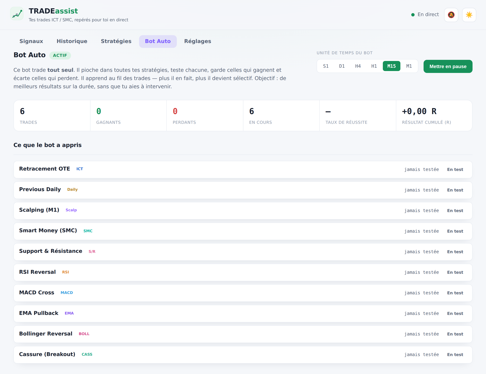

# TRADEassist — Signaux ICT / SMC en direct

Un site **statique** (aucun serveur) qui affiche en **temps réel** des setups de trading
fondés sur les concepts **ICT / SMC**, avec graphiques, calculateur de risque et alertes.



## Fonctionnalités

- **Deux stratégies**
  - **Stratégie 1 — OTE + PD Array + CRT** : zone **OTE** (0.62–0.79) du Fibonacci +
    **PD Array** (Fair Value Gap ou Order Block) en zone **discount/premium** +
    **CRT obligatoire** (sweep de liquidité + retour).
  - **Stratégie 2 — Previous Daily CRT** : balayage du **plus-haut / plus-bas de la veille**
    (PDH / PDL) suivi d'un retour ; objectif sur la liquidité opposée.
  - **Stratégie 5 — Support & Résistance** : zones testées **plusieurs fois** (rectangles, pas
    des lignes) sur **H4/Daily** → retour sur la zone → confirmation (rejet longue mèche,
    engloutissement, BOS/CHoCH) → stop derrière la zone, objectif sur la prochaine zone (ratio > 1:2).
  - **Stratégie 4 — Smart Money (SMC)** : approche Price Action / SMC (pensée forex, appliquée
    aussi à la crypto). **Tendance sur unité supérieure** (agrégée) → **retour sur une zone
    d'offre/demande** (Order Block / FVG) → **confirmation BOS/CHoCH ou rejet** → **objectif sur
    la prochaine liquidité** (swing opposé / equal highs-lows), ratio visé > 1:2.
  - **Stratégie 3 — Scalping (M1)** : tendance déterminée sur **M5** (agrégée depuis le M1),
    **retour sur une zone clé** (moyenne mobile / Order Block) puis **confirmation sur M1**,
    stop serré derrière le dernier creux/sommet, **objectif ≥ 2R**, avec filtre de
    **session** (Londres / New York). Le graphique de ces signaux s'affiche en M1.
- **Confiance proportionnelle** : plus il y a de confluences dans le même sens (OTE, tendance
  EMA 20/50, structure BOS/CHoCH, PD Array, clôture…), plus le pourcentage est élevé.
- Un signal n'est émis qu'avec **R:R ≥ 1.2**. On retient la meilleure des deux stratégies par paire.
- **Menu en sous-parties** : Signaux · Historique · Stratégies · Réglages.
- **Historique & bilan** : chaque signal repéré est archivé ; dès que le prix touche le stop
  ou l'objectif (TP1), le résultat est noté. Bilan gagnants / perdants, taux de réussite et
  résultat cumulé (en R). Tout est stocké localement.
- **Sélecteur de stratégies** : active/désactive chaque stratégie (registre extensible pour
  en ajouter d'autres facilement).
- **Apprentissage** : l'historique tire automatiquement des **conclusions** des trades clôturés
  — meilleure/pire stratégie, biais achat/vente, meilleure paire, taux de réussite et R cumulé.
- **10 stratégies** au total, dont 5 à indicateurs : **RSI Reversal**, **MACD Cross**,
  **EMA Pullback**, **Bollinger Reversal**, **Cassure (Breakout)** — objectif 2R.
- **Filtre par stratégie dans l'historique** et **unités de temps** S1 / D1 / H4 / H1 / M15 / M1.
- Le **Bot Auto** a son propre **sélecteur d'unité de temps** (il peut travailler sur un TF
  différent de l'affichage).
- **% de réussite estimé** sur chaque signal : mélange la confiance du setup et le taux de
  réussite réel de la stratégie (une fois assez de trades clôturés).
- **Bot Auto** (section dédiée 🤖) : un bot qui **trade seul** en piochant dans toutes les
  stratégies. Il teste chacune, **garde celles qui gagnent, écarte celles qui perdent**
  (au-delà de 4 trades, une stratégie sous 50 % est mise de côté). Il possède son propre
  historique, son bilan, son panneau « Ce que le bot a appris » (statut par stratégie) et ses
  conclusions. Objectif : de meilleurs résultats sur la durée, sans intervention.
- **Graphique chandeliers** intégré (façon TradingView, moteur Canvas maison, hors-ligne) :
  bougies, EMA, niveaux Fibonacci, zone OTE, boxes FVG / Order Blocks, liquidité,
  lignes Entrée / Stop / TP, croix de visée avec lecture OHLC.
- **Tableau de bord** : statistiques (setups, achat/vente, confiance moyenne, R:R moyen),
  filtres (direction, marché, tri), watchlist personnalisable.
- **Calculateur de risque** : capital + risque % → taille de position suggérée sur chaque signal.
- **Alertes** : son + notification navigateur + toast à chaque nouveau setup.
- **Thème clair / sombre**, réglages mémorisés localement.

## Marchés & données

- **Crypto** (BTC/USD, ETH/USD, SOL/USD) : API publique **Binance**, gratuite, sans clé.
- **Forex & Or** (GBP/USD, USD/JPY, EUR/JPY, XAU/USD, XAU/EUR) : **Twelve Data**,
  qui nécessite une **clé API gratuite** (https://twelvedata.com/register) à coller dans l'interface.

La crypto se rafraîchit ~ toutes les 40 s ; le forex/or ~ toutes les 4 min (quota gratuit).

## Utilisation

Site statique — il suffit de l'ouvrir :

```bash
# option 1 : ouvrir directement
#   double-clic sur index.html

# option 2 : petit serveur local
python3 -m http.server 8000   # puis http://localhost:8000
```

### Déploiement (GitHub Pages)

*Settings → Pages → Deploy from a branch → dossier `/root`.* Aucune étape de build.

## Structure

```
index.html        Interface
css/styles.css    Thème (clair + sombre)
js/api.js         Données multi-fournisseurs (Binance + Twelve Data)
js/ict.js         Moteur d'analyse ICT/SMC (+ métadonnées graphique) — testable sous Node
js/chart.js       Graphique chandeliers Canvas
js/app.js         Orchestration, UI, alertes, modale, calculateur
```

Les paramètres de stratégie sont regroupés dans `CONFIG` en tête de `js/ict.js`.

---

⚠️ **Avertissement** — Outil **éducatif**. Ceci n'est **pas** un conseil financier.
Le trading comporte un risque de perte. Fais toujours ta propre analyse et gère ton risque.
